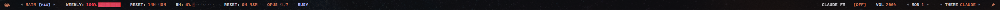
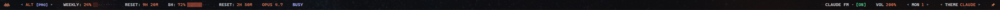
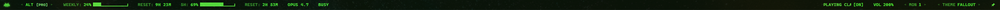
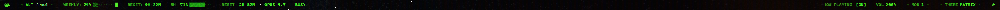
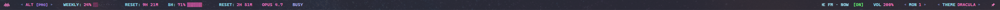

<p align="center"></p>

<h1 align="center">👾 ClaudePanel</h1>

<p align="center"><strong>A retro-styled desktop HUD for Claude Code.</strong><br/>
Monitor token usage, switch accounts, dock across monitors, and stream Lo-Fi radio — all from a native cross-platform utility bar.</p>

<p align="center">
  
  
  
  
  
</p>

<p align="center"></p>

<p align="center"><em>Always-on-top · Frameless · Multi-monitor Dock · Pin / auto-hide on hover · System tray · Multi-account</em></p>

---

## 💡 Why ClaudePanel?

A permanent lightweight desktop HUD for Claude Code users — live token monitoring, multi-account switching, cross-monitor docking, retro terminal aesthetics, ambient Lo-Fi radio, zero-browser workflow.

Unlike browser dashboards or terminal-only tools, ClaudePanel lives directly in your desktop environment with native OS integrations: Windows AppBar reservation, macOS LaunchAgents, Linux `_NET_WM_STRUT_PARTIAL`, system-tray everywhere.

## 👤 Built for

- Claude Code power users running long sessions
- Teams juggling multiple Claude accounts
- Terminal enthusiasts and retro / CRT-aesthetic fans
- Anyone who prefers a HUD over an extra browser tab

---

## 🎬 Demo

<!-- TODO: drop GIFs into docs/demo/ and replace this section with a 3-column table:
| Themes | Auto-hide | Claude FM |
|---|---|---|
|  |  |  |
-->

_Animated demos coming soon. For now, see [the bar layout above](#-claudepanel) and the [themes](#-visual-design) section below._

---

## 🖥️ Core Features

- **Live token usage** — weekly + hourly consumption, percentage, shaded progress bar, reset countdown
- **Multi-account** — switch any number of Claude accounts (separate `~/.claude` paths) via tray or Settings
- **Multi-monitor docking** — pick the target monitor at any time; reserves screen space on Windows + Linux X11
- **Pin / auto-hide on hover** — unpin to slide the bar off-screen; cursor at top edge slides it back
- **System tray** — switch account, switch monitor, toggle start-on-login, manage accounts, quit
- **Start on login** — native autostart on all three platforms
- **5 retro themes** — Claude, Fallout, Amber, Matrix, Dracula
- **Headless Claude FM** — embedded Lo-Fi YouTube stream with custom volume control

---

## 🚀 Quick Start

Download from the [Releases](../../releases/latest) page:

| Platform | File | Notes |
|---|---|---|
| Windows 10/11 x64 | `ClaudePanel-*-windows-amd64-setup.exe` | NSIS installer. Requires [WebView2 Runtime](https://go.microsoft.com/fwlink/p/?LinkId=2124703) (pre-installed on Win11). |
| macOS 10.13+ (Intel + Apple Silicon) | `ClaudePanel-*-macos-universal.pkg` | Double-click to install to `/Applications`. |
| Debian / Ubuntu | `claudepanel_*_amd64.deb` | `sudo apt install ./claudepanel_*_amd64.deb` |
| Fedora / RHEL | `claudepanel-*.x86_64.rpm` | `sudo dnf install ./claudepanel-*.x86_64.rpm` |
| Any Linux (portable) | `ClaudePanel-x86_64.AppImage` | `chmod +x ClaudePanel-x86_64.AppImage && ./ClaudePanel-x86_64.AppImage` |

Installers wire up Claude Code's `statuslineCommand` automatically and clean it up on uninstall — no terminal commands needed. AppImage users get a one-time first-run prompt instead.

<details>
<summary><strong>First-launch security warnings (unsigned v1)</strong></summary>

- **Windows** → SmartScreen "Windows protected your PC" → *More info* → *Run anyway*
- **macOS** → "ClaudePanel cannot be opened…" → System Settings → Privacy & Security → *Open Anyway*, or right-click the .app → *Open*
- **Linux .deb/.rpm** → no warnings (root install)
- **AppImage** → no warnings (user-mode)

</details>

<details>
<summary><strong>Build from source</strong></summary>

Requires Go 1.25+, Node.js 18+, Wails v2 CLI (`go install github.com/wailsapp/wails/v2/cmd/wails@latest`). On Linux also: `libgtk-3-dev`, `libwebkit2gtk-4.1-dev`, `libayatana-appindicator3-dev`, `pkg-config`.

```bash
wails dev                                         # hot-reload dev mode
wails build -platform windows/amd64 -nsis         # Windows installer
wails build -platform darwin/universal            # macOS .app (then build/darwin/scripts for .pkg)
wails build -platform linux/amd64 -tags webkit2_41  # Linux binary (then nfpm/AppImage via build/linux/*)
```

</details>

---

## 🎨 Visual Design

Five distinct CRT-scanline-filtered themes, cycle on the fly:

| Theme | Vibe |
|---|---|
| 🔸 **CLAUDE** (default) | Flat CLI — signature terracotta orange (`#d77757`), lavender badges (`#b1b9f9`), white headers |
| 🟢 **FALLOUT** | Pip-Boy green HUD, outlined progress brackets, glowing CRT scanlines |
| 🟡 **AMBER** | DEC VT100 / Fallout NV amber terminal — glowing values, dimmed labels |
| 📟 **MATRIX** | Digital rain — sharp green characters, blinking caret synced to warning status |
| 😈 **DRACULA** | Sleek dark mode — cyan labels, pastel pink progress |

<!-- TODO: add per-theme screenshots to docs/themes/ then drop in a 5-cell table:
| Claude | Fallout | Amber | Matrix | Dracula |
|---|---|---|---|---|
|  |  |  |  |  |
-->

### Typography & TUI glyphs

- **Developer-first font stack**: prefers Cascadia Mono / Cascadia Code, then SF Mono, Menlo, Fira Code, JetBrains Mono, DejaVu Sans Mono, Inconsolata — uses whatever's installed.
- **Retro shaded meters**: usage rendered with `░▒▓█` glyphs that change shade with warning tier; unused cells are faint terminal middle dots (`·`).

---

## 🛠️ Advanced Features

### Pin / auto-hide

A pin icon to the right of THEME toggles:
- **Pinned** (orange, tilted): docked, permanently visible — the default.
- **Unpinned** (gray, upright): bar slides up off-screen; cursor at the top edge slides it back.

<details>
<summary>Implementation notes</summary>

Go-side cursor polling at 80 ms — WebView2's `mouseleave` is unreliable on a 28 px window. A 200 ms grace period prevents accidental dismissal on cursor overshoot. The slide animates the OS window's Y position at ~60 fps (ease-out cubic) with a `SetWindowRgn` clip that masks any portion that would spill onto a monitor sitting above. (Windows only at v1; on macOS / Linux the toggle still affects docked-vs-floating state but the slide is a no-op.)

</details>

### Multi-monitor docking

Pick the target monitor from the tray menu. On Windows, **AppBar mode** uses `SHAppBarMessage` to reserve screen space — maximized windows automatically tile below. On Linux X11 it sets `_NET_WM_STRUT_PARTIAL` for compatible compositors. On macOS and Linux Wayland the bar floats at the topmost window level without reserving space.

### Claude FM (headless Lo-Fi radio)

Embedded YouTube audio stream — no browser windows needed.

- 📻 **Masked marquee**: when playing, the label scrolls `NOW PLAYING CLAUDE FM ·` horizontally behind a 75 px mask; reverts instantly on pause.
- 🔊 **0–200 % volume range**: extended headroom mapped linearly to YouTube's `0–100`.
- 🎛️ **Dual control**: scroll-wheel adjusts in 5 % steps; clicking `VOL` cycles in 10 % steps.
- 💾 **State persistence**: volume and theme saved to `localStorage`.

### Smart status overrides

Dynamic and static `OFFLINE` indicators are translated globally into a lavender **`IDLE`** badge (`#b1b9f9`) to preserve your active CLI context.

---

## 🧭 Architecture

```
Claude Code (CLI)
       │
       │  statuslineCommand hook
       ▼
~/.claude/rate_limits.json   ←  written every prompt
       │
       │  filesystem poll (refreshSeconds)
       ▼
ClaudePanel backend (Go)
       │
       │  Wails IPC (JSON bindings)
       ▼
WebView frontend (HTML/CSS/JS)
       │
       └── OS integrations: AppBar / NSWindow / X11 dock,
                            system tray, autostart, monitors
```

---

## ⚙️ Configuration

Auto-created on first run:

| Platform | Path |
|---|---|
| Windows | `%APPDATA%\ClaudePanel\config.json` |
| macOS | `~/Library/Application Support/ClaudePanel/config.json` |
| Linux | `$XDG_CONFIG_HOME/ClaudePanel/config.json` (fallback `~/.config/ClaudePanel/config.json`) |

```json
{
  "monitor": 0,
  "theme": "claude",
  "opacity": 0.92,
  "refreshSeconds": 15,
  "barHeight": 28,
  "appBarMode": true,
  "activeAccount": 0,
  "accounts": [
    { "name": "main", "path": "C:\\Users\\USER\\.claude" },
    { "name": "alt",  "path": "C:\\Users\\USER\\.claude-alt" }
  ],
  "startWithWindows": false
}
```

| Field | Description |
|---|---|
| `barHeight` | Pixel height of the bar |
| `refreshSeconds` | Re-read interval for Claude data files |
| `theme` | `claude`, `fallout`, `amber`, `matrix`, `dracula` |
| `appBarMode` | Reserve screen space (Windows / Linux X11 only) |

<details>
<summary><strong>How live usage capture works</strong></summary>

ClaudePanel reads `~/.claude/rate_limits.json`, populated by Claude Code's `statuslineCommand` hook. Installers set this hook automatically and clear it on uninstall by editing `~/.claude/settings.json` (only the `statuslineCommand` key — other keys are preserved).

If you built from source or are using the AppImage and want to configure manually:

```bash
claude config set statuslineCommand "node -e \"const fs=require('fs');const p=require('path');const os=require('os');const d=fs.readFileSync(0,'utf-8');if(d){const parsed=JSON.parse(d);fs.writeFileSync(p.join(os.homedir(),'.claude','rate_limits.json'),JSON.stringify({...parsed,captured_at:Date.now()}))}\""
```

Every Claude prompt then writes a tiny JSON payload to `rate_limits.json`, which ClaudePanel picks up instantly.

</details>

---

## 📁 Project Structure

```
claudepanel/
├── main.go                          # Wails bootstrap + embed directives
├── app.go                           # App struct + Wails-exported bindings
├── icon_{windows,darwin,linux}.go   # Per-OS tray icon embedding
├── internal/
│   ├── config/
│   │   ├── config.go                # Config struct, Load/Save, cross-platform AppDataDir
│   │   └── startup_{windows,darwin,linux}.go  # autostart (registry / LaunchAgent / .desktop)
│   ├── claude/                      # Read Claude JSON files, compute BarData
│   ├── platform/                    # Per-OS window + monitor APIs
│   │   ├── window_{windows,darwin,linux}.go
│   │   └── monitor_{windows,darwin,linux}.go
│   └── tray/                        # System tray via fyne.io/systray
├── frontend/                        # Wails webview UI
└── build/
    ├── windows/installer/           # NSIS template + statusline PowerShell script
    ├── darwin/scripts/              # pkgbuild postinstall/preuninstall bash scripts
    └── linux/                       # nfpm.yaml, .desktop, AppDir, AppRun, postinstall.sh
```

---

## ⚠️ Known limitations (v1 cross-platform)

- **Linux Wayland**: no portable protocol for "stay above other windows" or "reserve screen space". KWin honors `_NET_WM_WINDOW_TYPE_DOCK`; GNOME/Mutter mostly ignores it; wlroots compositors (Hyprland, Sway) vary. X11 sessions work correctly.
- **macOS docking**: NSWindow at `NSStatusWindowLevel` floats above other windows but can't reserve screen space the way Windows AppBar does — accepted as macOS-native behavior.
- **macOS Gatekeeper** (unsigned v1): see *First-launch security warnings* in Quick Start.
- **Settings merge safety**: if `~/.claude/settings.json` already exists but contains invalid JSON, the installer logs a warning and skips the modification rather than overwriting it.

---

## 📄 License

MIT — see [LICENSE](LICENSE).
